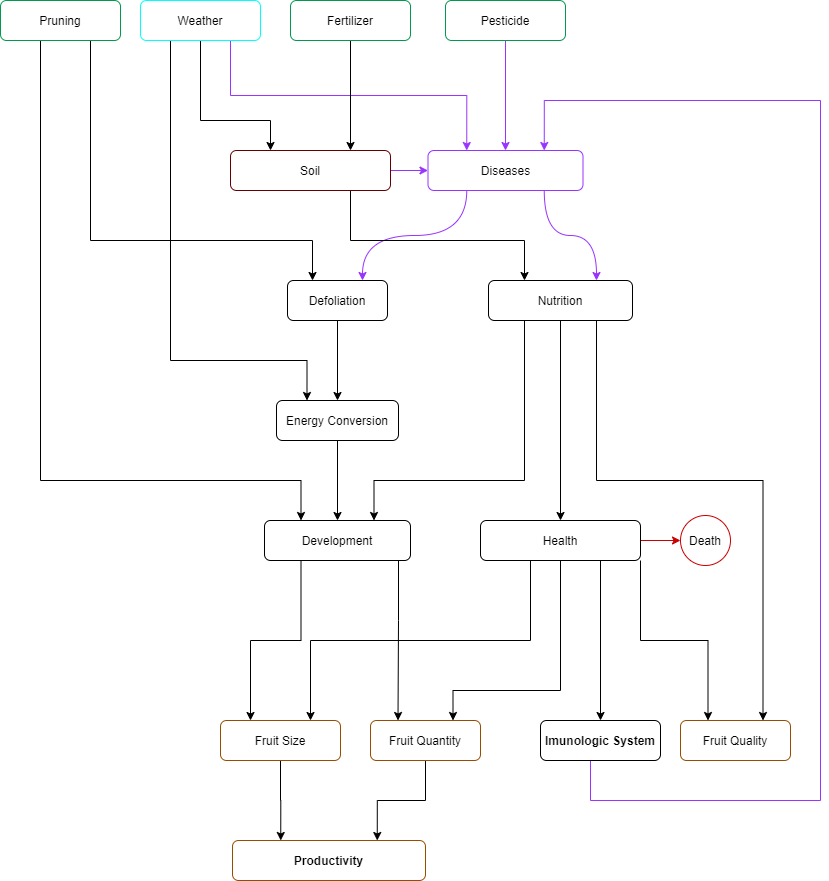
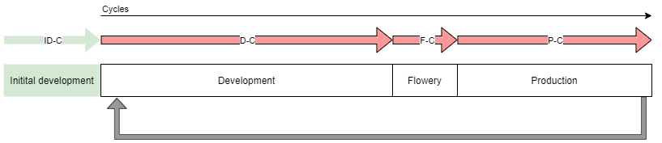

# Crop Model Diagram

# Coffee Lifescyle

ID-C : Initial Development Cycles = 50
D-C : Development Cycles = 100
F-C: Flowery Cycles = 10
P-C: Production Cycles = 40

### Development Stage
Will determine de amount of flowers and leaves.
Flower production has higher priority, but if leaf_rate is to low on the beginning of this stage, the plant will be forced to produce more leaves and less fruits.

### Flowery Stage
The max number of fruits is already determined on the last stage
In this stage, the flowers will grow and fall.
It will determine the amount of health fruits that will mature in the Production stage.

### Production Stage
The number of fruits determined by the end of the Flowery stage will develop.
This stage will determine fruit quality and avg size (although size is mainly defined by the variety)

# Coffee Crop model
### TODO: translate
### TODO: complete
- Nutrição
    - Componentes:
        - Água
        - Minerais
        - Matéria orgânica
    - Mecânica: A cada ciclo é extraída uma quantidade determinada pelo *fluxo de absorção* até que se alcance a *quantidade de saturação*. A saúde da planta em cada cíclo é determinada, entre outras coisas, pela qunatidade presente na planta.
        - Fluxo de absorção
        - Quantidade desejada
        - QUantidade de saturação   
    - A entidade Substract é um container de nutrientes.

- Saúde
    - Mecânica: a cada ciclo, a saúde é calculada/alterada com base em fatores da planta.
    - Afeta diretamente: Sistema imunológico, estado vital da planta (viva/morta)
    - Nutrição (Água, minerais, matéria orgânica)
        - Afetada por: baixa concentração no solo
        - Afeta: Capacidade de desenvolvimento
    - *Índice de desfolha*: percentual de folhas perdidas
        - Afetada por: doenças
        - Afeta: *Capacidade energética* (fotosíntese)
            - Afeta: Capacidade de desenvolvimento

- Desenvolvimento:
    - Afetado por:
        - Nutrição
        - Capacidade energética
    - Fases:
        - Desenvolvimento de ramos (crescimento)
        - Redução da desfolha (recuperação)
        - Desenvolvimento de frutos (produção)
    - Mecânica: A cada ciclo, a planta dedica um certo percentual para cada fase, totalizando 100%. O que influencia nessa distribuição? **TODO: Pesquisar**

 - Problemas
    - Ferrugem / Cercosporiose
        - Afeta: desfolha
        - Estágio ação: **TODO: pesquisar**
        - Ciclo de vida: **TODO: pesquisar**
    - Bicho Mineiro
        - Afeta: desfolha
        - Estágio ação: **TODO: pesquisar**
        - Ciclo de vida: **TODO: pesquisar**
    - Nematóide
        - Afeta: **TODO: pesquisar**
        - Estágio ação: **TODO: pesquisar**
        - Ciclo de vida: **TODO: pesquisar**
    - Broca
        - Afeta: produtividade
        - Estágio ação: enquanto há frutos
        ]- Ciclo de vida: fica viva, porém inativa em *frutos velhos remanecentes* **(TODO: novo parâmetro do modelo? Esse parâmetro pode ser usado para determinar a probabilidade de infeção pela broca)** após a colheita. Migram para frutos novos durante o estágio produtivo.
- Sistema imunolõgico
    - Mecânica: a cada ciclo, reduz a saúde de agentes presentes.
    - Natural
    - Defensivos
- Clima:
    - Temperatura
    - Humidade / Chuvas
- Geográfico
    - Relevo?
    - Altitude
